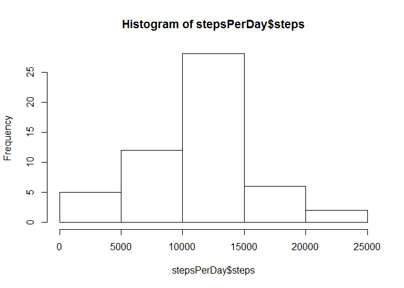
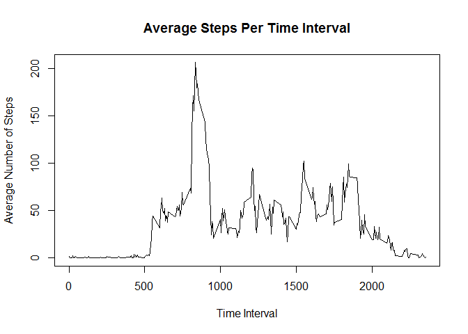
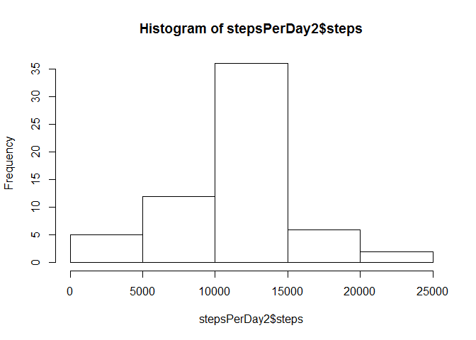
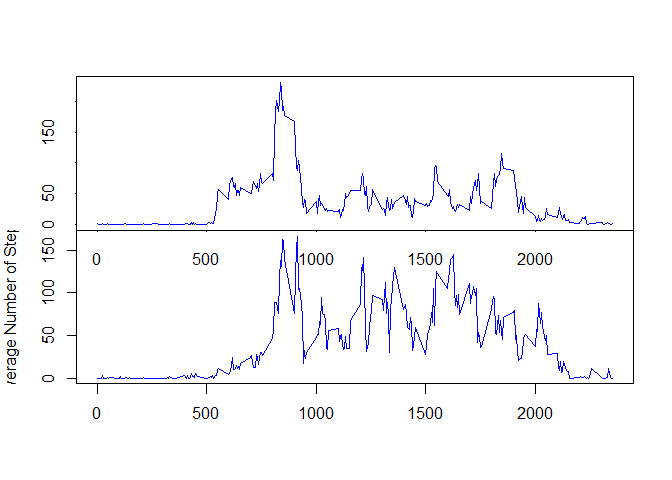

# Reproducible Research Course Project 1
PHallam-Mark  
January 9, 2016  

#Code and Output for the Coursera Reproducible Research Course Project #1

## Load and Preprocess the Data


```r
setwd("C:/Coursera_Temp/Reproducible Research")
```


read the activity data into a data frame

```r
rawActivity <- read.csv("activity.csv", as.is = TRUE)
```


convert the date column from character to date format

```r
rawActivity$date <- as.Date(rawActivity$date)
```


calculate the total number of steps for each day

```r
stepsPerDay <- aggregate(rawActivity$steps, list(rawActivity$date), sum)
colnames(stepsPerDay) <- c("date", "steps")
```

create a histogram plot of the total number of steps per day

```r
hist(stepsPerDay$steps)
```

\

calculate the mean and median of the total number of steps per day

```r
summary(stepsPerDay$steps)
```

```
##    Min. 1st Qu.  Median    Mean 3rd Qu.    Max.    NA's 
##      41    8841   10760   10770   13290   21190       8
```

##What is the average daily activity pattern?

calculate the average number of steps taken across all days for each 5-minute interval

```r
avgDailyActivityPattern <- aggregate(steps ~ interval, data = rawActivity, mean, na.rm = TRUE)
colnames(avgDailyActivityPattern) <- c("Five.Min.Time.Int", "Average.Num.Steps")
```

Make a time series plot (i.e. type = "l") of the 5-minute interval (x-axis) and the average number of
steps taken, averaged across all days (y-axis)

```r
plot(avgDailyActivityPattern$Five.Min.Time.Int, avgDailyActivityPattern$Average.Num.Steps,
     type="l", ylab="Average Number of Steps", xlab="Time Interval",
     main="Average Steps Per Time Interval")
```

\

determine Which 5-minute interval, on average across all the days in the dataset, contains the maximum number of steps

```r
avgDailyActivityPattern[avgDailyActivityPattern$Average.Num.Steps ==
  max(avgDailyActivityPattern$Average.Num.Steps), ]
```

```
##     Five.Min.Time.Int Average.Num.Steps
## 104               835          206.1698
```

##Imputing missing values
Calculate and report the total number of missing values in the dataset (i.e. the total number of rows with NAs)

```r
sum(is.na(rawActivity$steps))
```

```
## [1] 2304
```

create a copy of the original data frame and replace NA Average.Num.Steps values with the mean across all days for that 5-minute interval

```r
rawActivity2 <- rawActivity
numRows <- nrow(rawActivity2)
for (i in 1:numRows) {
  if(is.na(rawActivity2[i,"steps"])){
        interval <- rawActivity2[i,"interval"]
        avgSteps <- avgDailyActivityPattern[avgDailyActivityPattern$Five.Min.Time.Int == interval,"Average.Num.Steps"]
        rawActivity2[i,"steps"] <- avgSteps
  }
}
stepsPerDay2 <- aggregate(rawActivity2$steps, list(rawActivity2$date), sum)
colnames(stepsPerDay2) <- c("date", "steps")
```

create a histogram plot of the total number of steps per day

```r
hist(stepsPerDay2$steps)
```

\

calculate the mean and median of the total number of steps per day

```r
summary(stepsPerDay2$steps)
```

```
##    Min. 1st Qu.  Median    Mean 3rd Qu.    Max. 
##      41    9819   10770   10770   12810   21190
```

##Are there differences in activity patterns between weekdays and weekends?
Create a new factor variable in the dataset with two levels – “weekday” and “weekend” indicating whether a given date is a weekday or weekend day

```r
for (i in 1:numRows) {
  dayOfWeek <- weekdays(rawActivity2[i,2])
  if(dayOfWeek == "Saturday" | dayOfWeek == "Sunday"){
    rawActivity2[i,4] <- "F"
  }
  else {rawActivity2[i,4] <- "T"}
}

colnames(rawActivity2)[4] <- "Weekday?"
rawActivity2$`Weekday?` <- as.factor(rawActivity2$`Weekday?`)
```

calculate the average number of steps taken across all days for each 5-minute interval

```r
rawActivity2Weekdays <- subset(subset(rawActivity2, rawActivity2$`Weekday?` == "T"))
rawActivity2WeekendDays <- subset(subset(rawActivity2, rawActivity2$`Weekday?` == "F"))
avgDailyActivityPattern2Weekdays <- aggregate(steps ~ interval, data = rawActivity2Weekdays, mean)
avgDailyActivityPattern2WeekendDays <- aggregate(steps ~ interval, data = rawActivity2WeekendDays, mean)
colnames(avgDailyActivityPattern2Weekdays) <- c("Five.Min.Time.Int", "Average.Num.Steps.Weekdays")
colnames(avgDailyActivityPattern2WeekendDays) <- c("Five.Min.Time.Int", "Average.Num.Steps.Weeknd.Days")
avgDailyActivityPattern2Merged <- merge(avgDailyActivityPattern2Weekdays, avgDailyActivityPattern2WeekendDays,
     by="Five.Min.Time.Int")
```

Make a panel plot containing a time series plot (i.e. type = "l") of the 5-minute interval (x-axis) and the average number of steps taken, averaged across all weekday days or weekend days (y-axis)

```r
par(mfrow = c(2,1),
  mar = c(0,4,0,0), oma = c(5, 0, 4, 2))
plot(avgDailyActivityPattern2Merged$Five.Min.Time.Int, avgDailyActivityPattern2Merged$Average.Num.Steps.Weekdays,
     type="l", col="blue", ylab="", xlab="", tcl = NA)
plot(avgDailyActivityPattern2Merged$Five.Min.Time.Int, avgDailyActivityPattern2Merged$Average.Num.Steps.Weeknd.Days,
     type="l", col="blue", ylab="Average Number of Steps",xlab="Time Interval")
```

\


